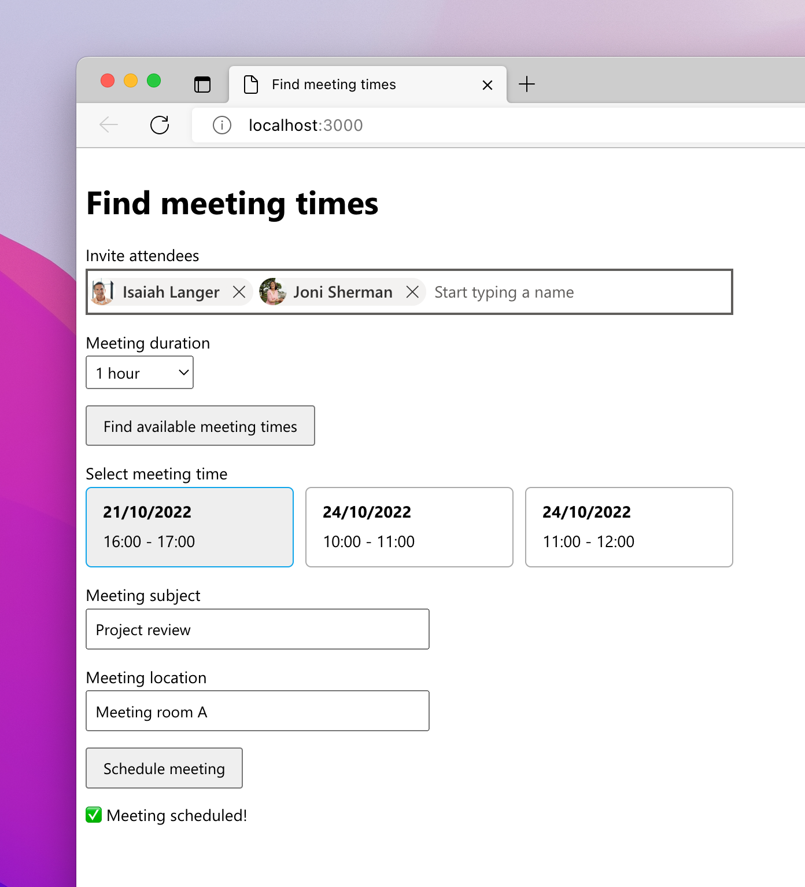

# Sample single page application for finding meeting time for multiple people on Microsoft 365

This repo contains a sample single page application (SPA) that shows how to find a suitable meeting time for multiple people that use Microsoft 365. The app is built using the Microsoft Graph Toolkit and Microsoft Graph.

## Prerequisites

- [Node.js LTS](https://nodejs.org)
- Microsoft 365 developer tenant, you can get it for free through the [Microsoft 365 developer program](https://developer.microsoft.com/microsoft-365/dev-program?WT.mc_id=m365-79878-wmastyka)

## Minimal path to awesome

1. Clone the repo
1. Change the working directory to the repo folder
1. Start terminal, change the working directory to the repo folder and run: `chmod +x setup.sh`
1. Run the setup script: `./setup.sh`
1. Start the development server: `npx lite-server`
1. In your web browser open `http://localhost:3000/index.html`

## Concepts introduced in this sample

- Allowing users to sign in to the application using their Microsoft 365 account with the [Microsoft Graph Toolkit's](https://learn.microsoft.com/graph/toolkit/overview?WT.mc_id=m365-79878-wmastyka) [Login](https://learn.microsoft.com/graph/toolkit/components/login?WT.mc_id=m365-79878-wmastyka) component
- Programmatically initializing the [MSAL2 auth provider](https://learn.microsoft.com/graph/toolkit/providers/msal2?WT.mc_id=m365-79878-wmastyka) from Microsoft Graph Toolkit
- Initializing Microsoft Graph Toolkit authentication provider with [predefined scopes](https://learn.microsoft.com/graph/toolkit/providers/providers?WT.mc_id=m365-79878-wmastyka#permission-scopes)
- Using the Microsoft Graph Toolkit [people picker](https://learn.microsoft.com/graph/toolkit/components/people-picker?WT.mc_id=m365-79878-wmastyka) component to select people
- [Find available meeting times](https://learn.microsoft.com/graph/api/user-findmeetingtimes?view=graph-rest-1.0&tabs=javascript&WT.mc_id=m365-79878-wmastyka) for the selected attendees using the Microsoft Graph
- [Create a meeting](https://learn.microsoft.com/graph/api/user-post-events?view=graph-rest-1.0&tabs=javascript&WT.mc_id=m365-79878-wmastyka) using the Microsoft Graph
- Conditionally showing content after the user has signed in
- [Using the Microsoft Graph JS SDK from the Microsoft Graph Toolkit](https://learn.microsoft.com/graph/toolkit/providers/providers?WT.mc_id=m365-79878-wmastyka#making-your-own-calls-to-microsoft-graph)
- Registering a new Azure AD application for a single page app using [CLI for Microsoft 365](https://aka.ms/cli-m365)
